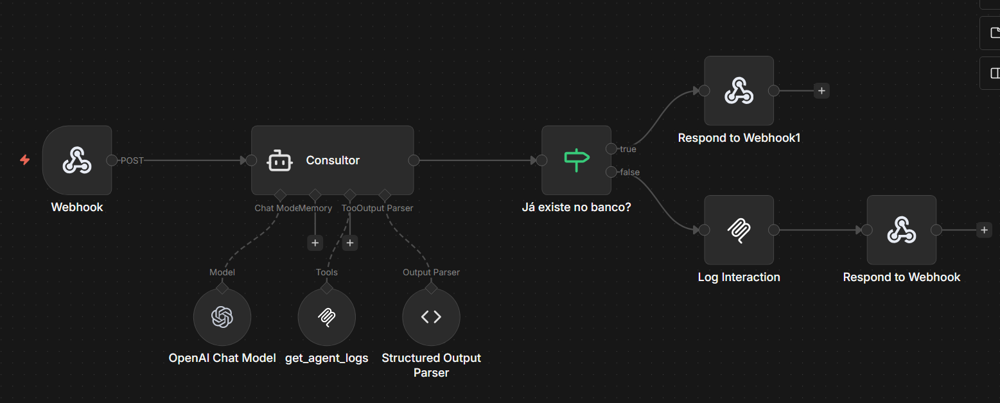

# MCP Python Server

Servidor MCP (Model Context Protocol) desenvolvido em Python para expor ferramentas (tools) que podem ser utilizadas por agentes de IA no n8n.

## 📋 Sobre o Projeto

Este servidor MCP fornece uma interface HTTP para que agentes de IA possam utilizar ferramentas customizadas, incluindo:

- **Logging de interações** de agentes no MongoDB
- **Consultas de logs** e estatísticas
- **Recursos e prompts** personalizados

## 🚀 Início Rápido

### Pré-requisitos

- Python 3.12+
- MongoDB (opcional, necessário apenas para ferramentas de logging)
- Docker e Docker Compose (opcional, para execução via container)

### Instalação

1. Clone o repositório:
```bash
git clone <repository-url>
cd mcp-python
```

2. Crie um arquivo `.env` na raiz do projeto:
```env
MCP_SERVER_NAME=mcp-python-server
MCP_HOST=0.0.0.0
MCP_PORT=2000
MCP_API_KEY=seu-token-secreto-aqui

# MongoDB (opcional)
MONGODB_URI=mongodb://localhost:27017
MONGODB_DATABASE=ai_agents_logs
MONGODB_COLLECTION_AGENTS_LOGS=agent_logs
```

3. Instale as dependências:
```bash
# Ativar ambiente virtual
source venv/bin/activate  # Linux/Mac
# ou
venv\Scripts\activate  # Windows

# Instalar dependências
pip install -r requirements.txt
```

### Executando o Servidor

**Opção 1: Via Docker**
```bash
docker-compose up -d
```

**Opção 2: Localmente (Recomendado)**
```bash
python main.py --http
```

O servidor estará disponível em `http://localhost:2000`

### Testando o Servidor

Para rodar o servidor no modo de desenvolvimento utilizando [uvicorn](https://www.uvicorn.org/):

```bash
uv run mcp dev main.py
```

## 🔧 Ferramentas Disponíveis

O servidor expõe as seguintes ferramentas:

| Ferramenta | Descrição |
|------------|-----------|
| `add` | Soma dois números |
| `log_agents_interaction` | Registra interações de agentes no MongoDB |
| `get_agents_logs` | Recupera logs de agentes com filtros opcionais |
| `get_agents_statistics` | Obtém estatísticas de um agente específico |

## 🔗 Integração com n8n

Para usar este servidor MCP no n8n, configure o nó **MCP Client Tool**:

### Configuração Básica

1. **Endpoint**: `http://localhost:2000` (ou `http://host.docker.internal:2000` se o n8n estiver em container)
2. **Server Transport**: `HTTP Streamable`
3. **Authentication**: `Bearer Auth`
4. **Bearer Token**: O valor de `MCP_API_KEY` do seu `.env`
5. **Tools to Include**: `All` (ou selecione as ferramentas específicas)

### Exemplo de Workflow no n8n



O exemplo acima mostra uma configuração básica de um workflow no n8n:

- **MCP Client Tool**: Conectado ao servidor MCP Python
- **AI Agent**: Agente de IA que utiliza as ferramentas expostas pelo servidor

**Fluxo típico:**
1. Usuário envia uma solicitação via Webhook
2. O AI Agent processa a solicitação
3. O agente pode utilizar as ferramentas MCP (ex: `log_agents_interaction` para registrar interações)
4. O agente retorna a resposta ao usuário

## 🛠️ Desenvolvimento

### Estrutura do Projeto

```
mcp-python/
├── auth/              # Autenticação e verificação de tokens
├── config/            # Configurações do servidor
├── core/              # Funcionalidades principais (lifespan, etc.)
├── database/          # Conexão e repositórios do MongoDB
├── handlers/          # Tools, resources e prompts
├── logs/              # Sistema de logging
├── utils/             # Utilidades
└── main.py           # Ponto de entrada do servidor
```

### Adicionando Novas Ferramentas

Para adicionar uma nova ferramenta, edite `handlers/tools.py`:

```python
@mcp.tool()
def minha_nova_ferramenta(param1: str) -> str:
    """Descrição da ferramenta.
    
    Args:
        param1: Descrição do parâmetro
        
    Returns:
        Descrição do retorno
    """
    # Implementação da ferramenta
    return resultado
```
